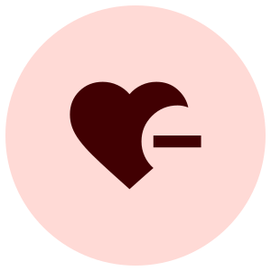
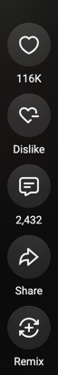

  

# Return YouTube Shorts Dislike

A Firefox extension that adds a working **Dislike** button next to the Like button on YouTube Shorts, and shows the real dislike count using the [Return YouTube Dislike](https://returnyoutubedislike.com/) API.

## How it works

**1. A Dislike button is added next to Like**

On every Shorts page, the extension finds the real Like button and inserts a "Dislike" button right next to it.

**2. The dislike is sent using your own session cookies**

Clicking it sends the same request YouTube's own Dislike button sends, straight from the page using your existing login cookies — no extra tab, no page reload.

---

###### I noticed this issue and built this project using an LLM help. Because I didn't have time and don't know soo much JavaScript.
